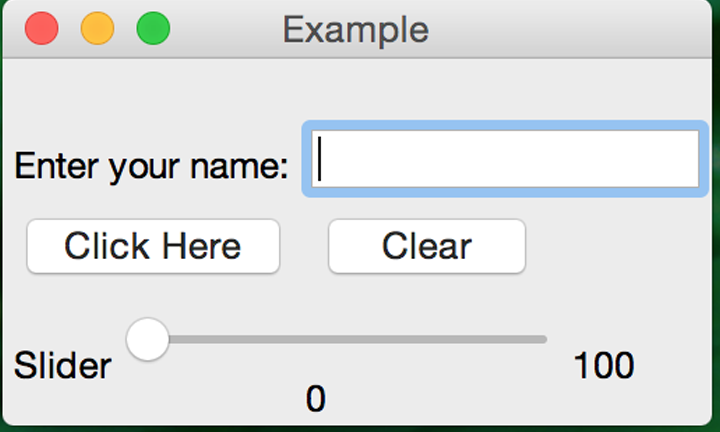

# Final Project Assignment 2: Explore One More! (FP2) 
DUE March 30, 2015 Monday (2015-03-30)

### My Library: The Racket Graphical Interface Toolkit
The library's documentation can be found here: http://docs.racket-lang.org/gui/index.html

For the second exploration I decided to play around with the Racket Graphical Interface Toolkit. 
I chose this because for the final project I'd like to wrap a graphical interface around the RSound 
library and possibly build a synthesizer program. 

The first thing I did was the documentation's brief walkthrough on creating windows, canvases, and buttons. 
I then experimented with different user inputs, such as a text boxes and sliders, as well as arranging them 
in different configurations.  The container hierarchy is very similar to the ‘div’ and 'span' hierarchy when 
working with HTML and CSS. By building a tree of horizontal and vertical containers, almost any 
grid-based arrangement of controls and sub-windows can be pretty easily implemented. 

I then experimented with the different setters and getters for the controls. This included experiments 
as simple as taking the user input from a text field and displaying it to the user somewhere else. 

For example, a text-box is shown to the user, asking them to enter their name. 



After doing so, they may click to get a welcome message, or to clear the content. Both buttons 
have a callback procedures to carry out their appropriate actions. 

Also, a slider is shown. By default, all sliders have a gauge showing their current value just 
below them. I created a message field to the right, which is set by the slider’s callback. 
This was done simply to practice extracting a control’s setting and using it to change something 
elsewhere. In this instance, I set it to display the max value minus the current value. Rather 
than having the message field simply mimic the gauge built in to the slider, I wanted to show 
the message field was a separate entity being set by the callbacks that were being fired in the 
background. 

### Code

```
#lang racket

(require racket/gui/base)

; Make a frame by instantiating the frame% class
(define mainWindow (new frame% [label "Example"]))

; Make a static text message in the frame
(define msg (new message% [parent mainWindow]
                          [label ""]
                          [min-width 250]))
 
;;Creates text field to enter name
(define myText (new text-field%
     [label "Enter your name:"]
     [parent mainWindow]
     [min-width 50]))

;;Procedure to grab the text from a text box.
;;Must take the text field name as an argument. 
(define myGetText 
  (lambda (thisText)
  (send (send thisText get-editor) get-text)))

;; Procedure to clear out the text field for user's names. 
(define clearNameField
  (lambda (thisText)
    (send (send thisText get-editor) erase)))

;; Panel to contain the 'click here' and 'clear' buttons
(define buttonPanel (new horizontal-panel% [parent mainWindow]))

; Make a button in the main window
; Sends welcome message with name text field content.
(new button% [parent buttonPanel]
             [label "Click Here"]
             [callback (lambda (button event)
                  (send msg set-label
                        (string-append "Hello, "(myGetText myText) "!")))])

;;Button to clear content of name text field. 
(new button% [parent buttonPanel]
     [label "Clear"]
     [callback (lambda (button event)
                 (clearNameField myText))])

;; New panel to hold the slider and associated message field.
(define sliderPanel (new horizontal-panel% [parent mainWindow]))

;; Slider is added to the panel defined just above. 
(define mySlider (new slider%
     [label "Slider"]
     [min-value 0]
     [max-value 100]
     [parent sliderPanel]
     [callback (lambda (slider event)
                 (send slideMsg set-label (number->string (- 100 (send mySlider get-value)))))]))

;; Message field whose value will be set by the slider defined just above. 
(define slideMsg (new message% [parent sliderPanel]
                               [label "100"]
                               [min-width 50]))
 
; Show the frame by calling its show method
(send mainWindow show #t)

```
###Output
The output is simply a small window with the message field, text field, buttons, and slider as described above.


* output from your code demonstrating what it produced
* any diagrams or figures explaining your work 
 

1. [Create a **pull request**][pull-request] on the original repository to turn in the assignment.

